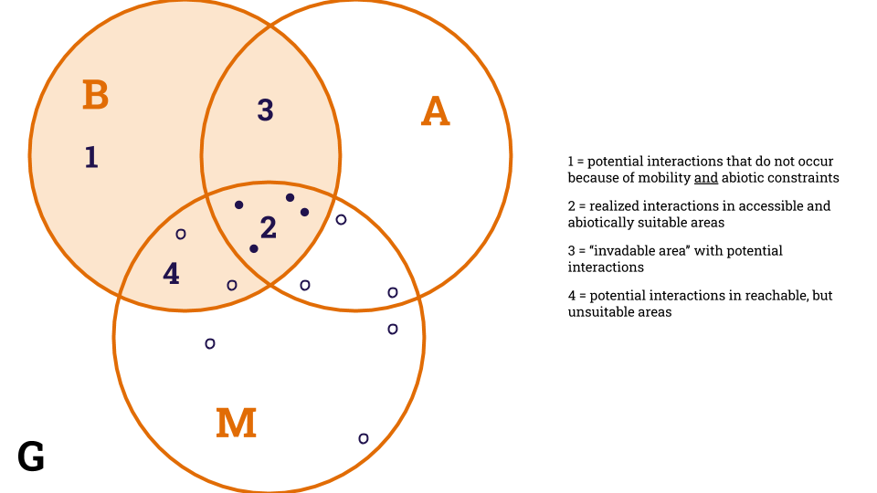

## Introduction  

The occurrence of a species in a given location is an encrypted message that
travels through time. It carries the species' evolutionary history, long
migration journeys, effects of other species we do not even know that exist, and
ultimately the elements that shape its, yet unknown, future. Ecologists have
been trying to decode this message with progressively more powerful tools, since
their own field notes to highly complex computational algorithms, such as
habitat suitability models. These models were born as an attempt to model
species' distribution based on their niche, considering their occurrences as
sample points of suitable abiotic variables and their absences as sample points
of unsuitable variables. However, these observations (environmental variables
and geographic location) only unveils part of the mystery, and the missing link
are ecological interactions. Habitat suitability models (hereafter HSMs) can be
untangled in three aspects of a species occurrence: its biotic environment - the
connections it makes with other species -, its abiotic environment - the
connection it makes with non-living resources -, and its mobility range - how
far it can go (+@fig:bam)[@Peterson2012EcoNic]. The biotic environment act on
these models as potential and realized interactions, constrained or enabled by
abiotic factors, geographical conformation and migratory ability.   

{#fig:bam}  
Fig. 1 - The "BAM diagram", adapted from [@JorgeSoberon2007GriElt]. Each circle
corresponds to the theoretical space of a species, regarding its biotic
interactions (the B), the abiotically suitable space (the A) and the geographic
area accessible to it (the M). These three aspects represent real points of
occurrence on the real geographic space (the G). Ecological interactions act
over this model in four ways: in (1), there are potential interactions that are
never realized because of geographical and environmental constraints; in (2)
interactions are realized on accessible, abiotically suitable areas; the space
(3) is where the species could eventually go and establish new interactions,
while (4) is the area where the occurrence of the species is limited only by
abiotic factors.  

Accounting for environmental variables and geographic limits on biodiversity
distribution models is a good approach because these characteristics are not
(highly) dynamic entities from the evolutionary point of view. Because the
climate (used to) change at a very slow pace, as well as species' niche, we
could expect to find the same pool of species that are able to live in a certain
region, even if populations fluctuated at a smaller temporal scale. This is
because the cumulative effect of small scale variation on climate, population
dynamics and habitat suitability itself result in macroecological outcomes such
as combinations of extinction and cladogenesis, which lead to biodiversity
distribution at continental scales. Also, abiotic variables are not under the
influence of the focus species, which make them statistically safe, and their
relationship with the species' niche is assumed to be static in space and time,
which adds generalization to the model. The biotic space, on the other hand, is
usually highly dynamic and variable, but varies from stochastic at very small
scales to predictable structures at large scales. For example, the effect of
mutualists can be positive or negative depending on their density
[@Wolin2015ModFac], which often fluctuates randomly throughout the history of a
population because of genetic effects. At large scales, ecological interactions
shape range limits of species while they are more or less likely to occur
according to the location of the population inside the species range
[@Godsoe2017IntBio; @Bar-Massada2017NonCoo; @Svenning2014InfInt]. Also,
ecological networks are the cumulative result of local events
[@Poisot2016HowEco; @Guimaraes2020StrEco] and its properties can vary with
environmental factors and species evolutionary history
[@MartinGonzalez2015MacPhy; @Dalsgaard2013HisCli].   

There is a big ecological and evolutionary leap between local dynamics of
species and the biogeographical processes that are the primary assumptions to
the habitat suitability and species distribution models. However, because
ecological networks are very informative and aggregate populations' dynamics
through scales, it is conceptually important to include them in HSMs. In fact,
it has been shown that HSMs are more efficient when ecological interactions are
accounted for (either directly or indirectly) [@Wisz2013RolBio;
@Cazelles2016IntBio]. Some strategies have been adopted by the scientific
community to accomplish that and are shortly reviewed later in this paper.
Correlative approaches assume that the co-ocurrence of related species accounts
for interaction, while mechanistic models try to refine this assumption by
species traits and phenology. Currently, the scenario of habitat suitability
models accounting for the biotic environment is either too generalistic
(correlative approaches) or too precise (mechanistic), in the sense that they
only work when we have a good amount of information about that specific species.
However, empirical data on ecological interactions are scarce, and, on the other
hand, we cannot just assume that two species will always interact when they
co-occur. How could we find balance and go further?

The good news is that ecologists have been developing techniques to predict and
forecast the ecologically realistic number of links [@MacDonald2020RevLin], the
nature of ecological interactions [@Elmasri2020HieBay], and networks' properties
with good accuracy. These techniques can mitigate the large and biased eltonian
shortfall that we have now [@Poisot2020EnvBia; @Hortal2015SevSho]. In this
context, we can envision an integrative approach of species distribution
modelling combined with network prediction resulting in a more realistic, yet
generalist, model where the predicted networks update the probabilities of
occurrence computed by an HSM. In this paper we invite you to envision better
species distribution models, which do not ignore our knowledge about ecological
networks and communities assemblage. Here we suggest this can be done with the
help of machine learning techniques both to predict local networks and to update
the results of grinellian HSMs. We point to promising directions on the
development of these techniques and main challenges ecologists might face in the
near future.

## HSMs: the mechanics, innovations and drawbacks  

## Going further  

### Eltonian Noise  

### Non-stationarity of interactions and networks in space, time and across resolutions  

### Why go further? Because we can!  

### How  

#### Filling in eltonian gaps with mathematics - predicting interactions, networks, and doing it across scales  

#### Updating probabilities of occurrences with network probabilities  

## Take-home messages   

## References
