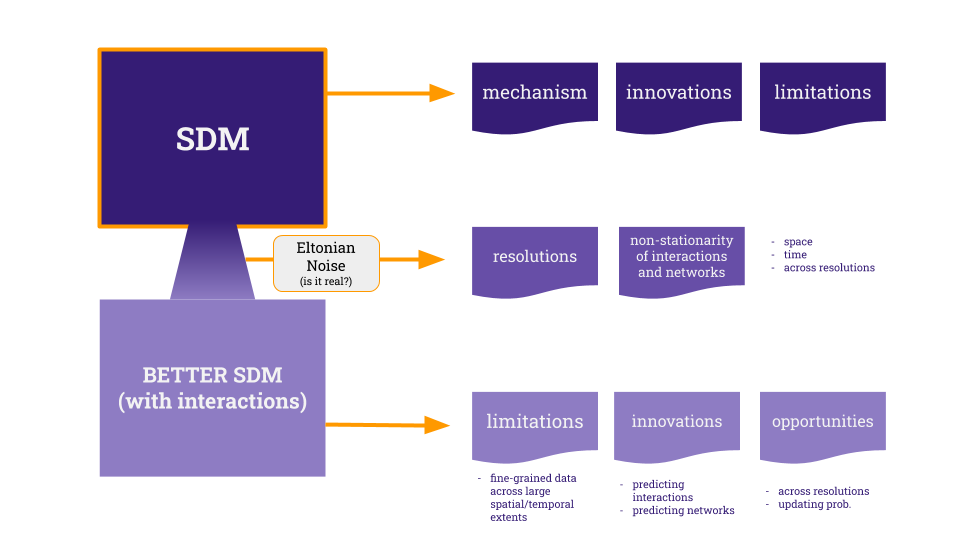

## Introduction  

The occurrence of a species in a given location is an encrypted message that
travels through time. It carries the species' evolutionary history, long
migration journeys, effects of other species we do not even know that exist, and
ultimately the elements that shape its, yet unknown, future. Ecologists have
been trying to decode this message with progressively more powerful tools, since
their own field notes to highly complex computational algorithms, such as
habitat suitability models. These models were born as an attempt to model
species' distribution based on their niche, considering their occurrences as
sample points of suitable abiotic variables and their absences as sample points
of unsuitable variables. However, these observations (environmental variables
and geographic location) only unveils part of the mystery, and the missing link
are ecological interactions. Habitat suitability models (hereafter HSMs) can be
untangled in three aspects of a species occurrence: its biotic environment - the
connections it makes with other species -, its abiotic environment - the
connection it makes with non-living resources -, and its mobility range - how
far it can go (@fig:bam)[@Peterson2012EcoNic]. The biotic environment act on
these models as potential and realized interactions, constrained or enabled by
abiotic factors, geographical conformation and migratory ability.   

![The "BAM diagram", adapted from [@JorgeSoberon2007GriElt]. Open circles
are absences and solid circles are observed presences. Big circles correspond to
the theoretical space of a species, regarding its biotic interactions (the B),
the abiotically suitable space (the A) and the geographic area accessible to it
(the M). These three aspects represent real points of occurrence on the real
geographic space (the G). Ecological interactions act over this model in four
ways: in (1), there are potential interactions that are never realized because
of geographical and environmental constraints; in (2) interactions are realized
on accessible, abiotically suitable areas; the space (3) is where the species
could eventually go and establish new interactions, while (4) is the area where
the occurrence of the species is limited only by abiotic factors.](figures/bam.png){#fig:bam}  

Accounting for environmental variables and geographic limits on biodiversity
distribution models is a good approach because these characteristics are not
(highly) dynamic entities from the evolutionary point of view. Because the
climate (used to) change at a very slow pace, as well as species' niche, we
could expect to find the same pool of species that are able to live in a certain
region, even if populations fluctuated at a smaller temporal scale. This is
because the cumulative effect of small scale variation on climate, population
dynamics and habitat suitability itself results in macroecological outcomes such
as combinations of extinction and cladogenesis, which lead to biodiversity
distribution at continental scales. Also, abiotic variables are not under the
influence of the focus species, which make them statistically safe, and their
relationship with the species' niche is assumed to be static in space and time,
which adds generalization to the model. The biotic space, on the other hand, is
usually highly dynamic and variable, but varies from stochastic at very small
scales to predictable structures at large scales. For example, the effect of
mutualists can be positive or negative depending on their density
[@Wolin2015ModFac], which often fluctuates randomly throughout the history of a
population because of genetic effects. At large scales, ecological interactions
shape range limits of species while they are more or less likely to occur
according to the location of the population inside the species range
[@Godsoe2017IntBio; @Bar-Massada2017NonCoo; @Svenning2014InfInt]. Also,
ecological networks are the cumulative result of local events
[@Poisot2016HowEco; @Guimaraes2020StrEco] and its properties can vary with
environmental factors and species evolutionary history
[@MartinGonzalez2015MacPhy; @Dalsgaard2013HisCli].   

There is a big ecological and evolutionary leap between local dynamics of
species and the biogeographical processes that are the primary assumptions to
the habitat suitability and species distribution models. However, because
ecological networks are very informative and aggregate populations' dynamics
through scales, it is conceptually important to include them in HSMs. In fact,
it has been shown that HSMs are more efficient when ecological interactions are
accounted for (either directly or indirectly) [@Wisz2013RolBio;
@Cazelles2016IntBio]. Some strategies have been adopted by the scientific
community to accomplish that and are shortly reviewed later in this paper.
Correlative approaches assume that the co-ocurrence of related species accounts
for interaction, while mechanistic models try to refine this assumption by
species traits and phenology. Currently, the scenario of habitat suitability
models accounting for the biotic environment is either too generalistic
(correlative approaches) or too precise (mechanistic), in the sense that they
only work when we have a good amount of information about that specific species.
However, empirical data on ecological interactions are scarce, and, on the other
hand, we cannot just assume that two species will always interact when they
co-occur. How could we find balance and go further?

The good news is that ecologists have been developing techniques to predict and
forecast the ecologically realistic number of links [@MacDonald2020RevLin], the
nature of ecological interactions [@Elmasri2020HieBay], and networks' properties
with good accuracy. These techniques can mitigate the large and biased eltonian
shortfall that we have now [@Poisot2020EnvBia; @Hortal2015SevSho]. In this
context, we can envision an integrative approach of species distribution
modelling combined with network prediction resulting in a more realistic, yet
generalist, model where the predicted networks update the probabilities of
occurrence computed by an HSM. In this paper we invite you to envision better
species distribution models, which do not ignore our knowledge about ecological
networks and communities assemblage. Here we suggest this can be done with the
help of machine learning techniques both to predict local networks and to update
the results of grinellian HSMs. We point to promising directions on the
development of these techniques and main challenges ecologists might face in the
near future.

## HSMs: the mechanics, innovations and drawbacks  

Habitat suitability models aim at finding relationships between the occurrence
of species and their environment [@Guisan2000PreHab; @Guisan2017HabSui]. The
reader might have encountered different terminologies in this area, such as
species distribution modelling and ecological niche modelling, that supposedly
have the same objectives. The terminology is a matter of debate on the
scientific community, and here we chose to distinguish habitat suitability
models from species distribution models.  

Ecological niche models and habitat suitability models focus on the the area of
A of the BAM diagram [@fig:bam] where a species can occur, which means they
calculate the fundamental niche of species [@Peterson2012EcoNic]. This can be
achieved by finding the relationship between environmental conditions and the
presence or absence of a certain species. This relationship can be static or
dynamic in space, and only makes sense when calculated for the area inside M.
Therefore, this means that they will find suitable areas inside the area 2,
where species really are, but can also find suitable areas in 5, where the
species probably are not because of biotic unsuitability. Species distribution
models, on the other hand, should aim at modelling 2 (B $\cap$ A $\cap$ M), which
means considering biotic constraints [@Peterson2012EcoNic]. Although they rarely
do so, Guisan and Zimmermann (2000) argue that the observation data used as
input on these models carries these information: when we use the physiological
limits of a species as a variable to be correlated to the environment, we are
modelling its fundamental niche, while using observational field occurrence data
implies that we are modelling the realized niche (thus, the species
distribution) because these data implicitly accounts for biotic limitations
[@Guisan2000PreHab]. However, because the biotic constraints are not explicitly
considered in the models, it is possible that the predicted distribution area
reaches places with completely different communities. Because we did not
consider previous knowledge about species interactions, how can we interpret
this result? Given these differences between SDMs and HSMs, many statistical
approaches can be used to model both of them. Here we focus on the most
innovative algorithms to find the species' suitable habitats, to further develop
ideas on how to integrate biotic constraints.

Habitat suitability models are built over five steps: conceptualization, data
sampling, calibration, evaluation and prediction [@Guisan2017HabSui]. The
conceptualization is related to the core ideas of niche, as illustrated in
@fig:bam, but also to the main goals of the investigation. What processes are
important to the patterns we a dealing with, what is the frequency in which they
repeat in space (determining the grain and extent of the environmental
variables) and what are the direct and indirect predictors are examples of
questions that should be asked at this step. The answers to these questions will
determine how the data should be sampled (the spatial scale of the variables)
and the appropriate selection of the variables [@Guisan2000PreHab]. Then the
actual building of the mathematical model enters the stage, with iterative
adjustments to capture its variations. The data is separated in training
validation sets, and then the model is used to predict and project probabilities
is space that can be interpreted as habitat suitability.

<!---innovations--->
While statistical inference is a telescope that allows us to investigate the
past of biodiversity structure, machine learning algorithms are some of the time
machines we use to assess the past in order to predict the future. They have the
power to learn from the data, identifying structure and generating predictions
[@Olden2008MacLea]. One sound advantage of these models compared to statistical
inference is that they allow us to explore "mischievous" data, embracing the
multiple frequency distributions we find in nature. Many of them have become
popular among ecologists, such as MaxEnt [@Phillips2006MaxEnt] and Random Forest
[@Breiman2001RanFor], while making a good match with the continuously growing
amount of biodiversity data. Although these models call for cautious usage for
their complexity (and hard to interpret outputs) [@Rangel2012LabEco], it also
demands some ecological knowledge about the relationships being modelled and
careful parameterisation of terms. These very characteristics are the ones that
allow us to explore nuances of biodiversity relationships, such as the role of
ecological interactions in shaping species distribution - i.e. putting the B
back in the BAM model.     

<!---drawbacks--->
However, these time machines need a past to learn from, and the lack of
information about species interactions makes this past quite blurry. Ecological
interactions occur across taxonomic and geographic scales
[@Guimaraes2020StrEco], and the task to collect these information through large
extents and in fine grain (both temporal and spatial) is daunting. In addition,
it is known that networks vary with climate, in space and with phylogenetic
distance [@Poisot2014SpeWhy; CITATIONS]. Despite the dynamic nature of networks'
structures (that are predictable outcomes of common processes), methods such as stacked
(S-SDMs) and joint Species Distribution Models (JSDMs) are very common to
address the influence of one species over another [CITATIONS]. These methods
assume that, if a pair of species are known to interact, they will always do so
once they co-occur [CITATIONS]. For example, in order to do a stacked SDM, one
can model the assembly as a single unit, use the predicted distribution of each
species and pile them up together, or model species at the same time, but as
separate units [@Ferrier2006SpaMod]. On the other hand, JSDMs use a hierarchical
regression model to calculate the probability of occurrence of all species
together in response to environmental variables [@Pollock2014UndCoo]. Both
approaches can be considered great advances regarding previous methods that
simply added the distribution of one or more other species as limiting factors
in the model [CITATIONS]. S-SDMs and JSDMs try to incorporate another level of
complexity by modelling assembly rules as an intermediate step towards more
realistic HSMs (see @Zurell2020TesSpe for a comparison between both methods).
Nevertheless, our time machines can take us even further and incorporate actual
species interaction and predicted network properties in species distribution
models.

## Going further  

<!---why interactions in SDMs--->
Spatially structured co-occurrence can be the result of many historical and
geographical processes, such as environmental heterogeneity and the similarity
of environmental preferences between species [@Bar-Massada2017NonCoo]. HSMs that
account for co-occurrence as a proxy for interactions might wrongly capture
these processes as biotic interactions [@Blanchet2020CooNot]. An important analysis to be made
before going further is at which scale ecological interactions influence the
distribution of species. Although empirical evidence exists that ecological
interactions are important processes on population arrangements in space
[CITATIONS] and networks variation can be detected in macroecological scales
[CITATIONS], their precise relationship with spatial scale remains unclear.
A second challenge is to deal with highly dynamic properties of ecological
interactions. How can we account for dependency between local processes in
macroecological scales? We argue that Artificial Intelligence (AI) tools can
help us identify structure on the available data and predict interactions and
networks for communities we did not access yet.

### The Eltonian Noise paradox  

The Eltonian Noise Hypothesis states that the effect of ecological interactions
on species distribution is captured at coarse resolution analyses as a
covariation with environmental factors [@Soberon2009NicDis]. This logic reverts
as an assumption that always that two given species co-occur, they will
interact, which has been demonstrated to be not true [@Blanchet2020CooNot]. In
fact, the contrary is likely to be true: the nature of interactions happening at
a given location affects co-occurrence [@Chesson2008IntPre; @Godsoe2017IntBio;
@Svenning2014InfInt; @Bullock2000GeoSep], and they vary in space and time due to
climate change, phylogenetic diversity (addition or extinction of clades in the
community, for example)[@Davies2011PhyDiv], population density
[@Carnicer2009TemDyn], and many other factors. Additionally, analyses of range
expansion rates - a common and very important application of HSMs - are
intrinsically connected to interspecific interactions at the border of the
ranges: the expansion tends to be slower when generalists predators are present
or when mutualists are absent [@Svenning2014InfInt]. On the other hand, range
preservation is also associated with ecological interactions, once connected
species can be protected of climate change and invasion [@Dunne2002NetStr;
@Memmott2004TolPol; @Ramos-Jiliberto2012TopPla].  

This hypothesis also seems to find no support when we investigate the
betadiversity of links in ecological networks. In parasite-hosts systems in
Eurasia, it is possible to detect a distinct difference in interactions between
shared species in macroecological scale, suggesting an "unpacking" of species
when biodiversity is expected to be lower [CHAPTER 1]. In addition, it is
likely that species with larger ranges of distribution and those that are more
generalists would co-occur with a greater number of other species
[@Dattilo2020SpeDri], while dispersal capacity of competitive species modulate
their aggregation in space and the effect of interactions on their range limits
[@Godsoe2017IntBio].  

Certainly, the exact macro scale effect of interspecies interactions might
depend on the nature of these interactions, the system being studied and the
combination of geographical and environmental factors. Younger communities may
be more affected by environmental limitations, once they are dominated by
generalist species, while older metacommunities are probably affected in
different ways in the centre of the distribution, at the edge of ranges and in
sink and source communities. In fact, there is a growing number of evidence
demonstrating that biotic interactions are important factors modulating range
shift and expansion due to rapid climate change (where evolutionary processes
are ignored, assuming that species will not have time to adapt)
[@Bullock2000GeoSep; @Hellmann2012InfSpe; @Afkhami2014MutEff; @Godsoe2017IntBio;
@Siren2020IntRan].  

Modelling species distribution considering the Eltonian Noise Hypothesis to be
true can be very useful to understand general structures of biodiversity. At
coarse resolutions, with dubious quality and sparse data, and when the space for
error is large, these models are probably the best we can do. However, no species is an
island and we should go further whenever possible, investigating whether and how
ecological interactions exert important pressures on species ranges and spatial
arrangements. This will help us avoid spurious inferences, especially when these
models aim at conservation strategies. Fortunately, the data we need to do that
has been increasingly available [@Konig2019BioDat], and technologies to deal
with them (with their biases and gaps) are following.  

### Non-stationarity of interactions and networks in space, time and across resolutions  

Ecological interactions are dynamic entities of ecosystems that vary in space
and time. The reason for this fluctuability is a combination of factors that
shape the probability of interactions: environmental changes that affect the
metabolism of individuals and the abundance of populations [@Rall2012UniTem;
@Poisot2016StrPro; @Muola2010AssPla], changes in habitat
[@Tylianakis2017EcoNet], and the phylogenetic structure of communities
[@Coelho2017NeuBio]. Notably, the variation in traits distribution (including
phenological mismatches) are important drivers of variation in species
interactions [CITATIONS].  

Ecological networks reflect these dynamics, and, as a result, varies in space
not always in the same fashion that species richness do [@Poisot2014SpeWhy]. The
non-stationarity of ecological networks and their relationship with the
environment can be measured and have been demonstrated in the last few years.
@Dalsgaard2013HisCli found that modularity can be reduced and nestedness
increased due to climate change speed [@Dalsgaard2013HisCli]. The phylogenetic
diversity of networks is affected by dispersion and speciation rates
[@Coelho2017NeuBio; @Sebastian-Gonzalez2015MacTre; @Trojelsgaard2013MacPol],
characteristics highly correlated to both traits and geographical structure of
the environment. These examples illustrate how networks can vary both in space
(due to environmental filtering of species traits, for example) and time (due to
evolutionary changes and phenology).  

Interestingly, because ecological networks are the cumulative pool of local
interactions, it is possible that network structure varies across scales
[@Galiana2018SpaSca]. For example, increased species richness can promote
species packing and specialization of interactions at local scale even for
generalist species [CITATIONS; CHAP 1]. Moreover, the local combinations of
species and interactions in a community can result in very different regional
pictures, since interactions can affect one another. For example
@Sanders2012IndCom observed that the persistence of two species of wasps
separated by four trophic links are conditioned to one another because they
regulate the population of competitive aphids [@Sanders2012IndCom]. The
replacement of one species in this network can result in the local extinction of
another, even if they are not directly linked, and this dynamic could be easily
misinterpreted in regional scales as an environmental constraint.

All these peculiarities about ecological interactions and networks can be faced
as challenges or opportunities for the next years. Once we understand how and
where interactions are important to the accuracy of species distribution models,
we can use the dynamics described here as refinements on our models. On the
other hand, some of these mechanisms act at a scale so small that stochasticity
takes the stage and can be accounted for in the error term of most models. This
trade-off reinforces the need to carefully adjust distribution models according
to the system being studied.

### Why we can go further  

A combination of global efforts and technology can make us take another step in
combining species occurrence data and ecological interactions. In the last
decades we have witnessed an increase in biodiversity data, including
citizen-science projects [@Pocock2015BioRec; @Callaghan2019ImpBig] and organized
dedicated databases mostly accessed by specialists, such as mangal and GBIF
[@Poisot2016ManMak; @Gbi]. These data frequently describe the occurrence and the
taxonomic identity of a species, but they also capture real-time interactions
[@Roy2016FocPla; @Ryan2018RolCit]. Moreover, both occurrence and interaction
data share common characteristics that can be learned and subsequently inferred.
Because species occurrence are subject to their evolutionary history that shaped
their ecological niche, one can roughly infer where it could occur only based on
known occurrence point locations (that is how HSMs work, as described earlier in
this paper). This is connected to how ecological networks also show signs of
common ancestry and preserve a basic structure [@Riva2016ExpEvo; @Dallas2018ComTur]. The
ever-growing number of available data and detectable structure on ecological
networks are the main ingredients we need to develop mathematical models capable
of learning from what we already know to predict what we do not know yet.

#### Filling in eltonian gaps with mathematics - predicting interactions, networks, and doing it across scales  

A complete assessment of ecological interactions is even more difficult than
sufficient sampling of biodiversity. The number of interactions sampled will
always be lower than the number of possible interactions, mainly due to the
existence of forbidden links [@Jordano2016SamNet]. In the same way as the
knowledge about the natural history of organisms help us validate HSMs, it can
also help us identify if the lack of links sampled is due to insufficient effort
or natural mismatch between species. Recently, @MacDonald2020RevLin demonstrated
how we can estimate the number of possible links in a network based on the
number of species it has, which take us closer to predict networks themselves
since we have much more information about species than we have of interactions
[@MacDonald2020RevLin].

In fact, assuming interactions as probabilistic events is more of an opportunity
than an obstacle. Once we understand what is the basic mix than can result in a
connection between ecological units (from individuals to ecosystems), we can use
probabilities to estimate the likelihood of our ideas even when data is lacking.
Usually, this basic mix is composed by abundance, traits matching and
co-occurrence in space and time [CITATIONS]. When we do not have information
about any of these properties, the prediction of interactions tends to
stochastic, while the more information we have, the more our equations will look
like a niche models. @Canard2012EmeStr illustrates how we can build neutral
networks based on species abundance and richness, and found that the emergent
properties of these networks are compatible with empirical ones. With this
method, it is possible to identify neutral forbidden links [@Canard2012EmeStr],
which unfolds many other questions that can be answered without previous
empirical data.  

- interactions are probabilistic events [@Poisot2016StrPro; @MacDonald2020RevLin]
-
- example of phenology helping predict the lost of a link due to climate change: [@SimmondsPheAsy]
- From links to networks

#### Updating probabilities of occurrences with network probabilities  

## Take-home messages   

## References
