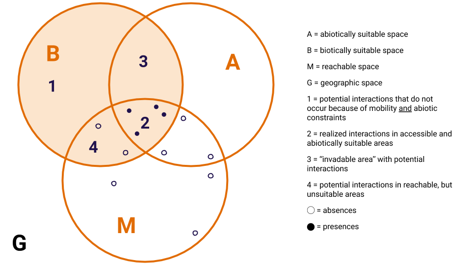

## Introduction  
The occurrence of a species in a given location is an
encrypted message that travels through time. It carries the species'
evolutionary history, long migration journeys, adaptation through generations,
effects of other species we do not even know that exist, and
ultimately the elements that shape its, yet unknown, future. Ecologists have
been trying to decode this message with progressively more powerful tools,
since their own field journals to highly complex computational algorithms,
such as habitat suitability models. These models were born as an attempt to
model species' distribution based on their niche, considering their
occurrences as sample points of suitable abiotic variables and their absences
as sample points of unsuitable variables. However, these observations
(environmental variables and geographic location) only unveils part of the
mystery, and the missing link are ecological interactions. Habitat
suitability models (hereafter HSMs) can be untangled in three aspects of a
species occurrence: its biotic environment - the connections it makes with
other species -, its abiotic environment - the connection it makes with
non-living resources -, and its mobility range - how far it can go
(+@fig:bam)(@Peterson2012EcoNic).  
{#fig:bam}  
+@fig:bam - The "BAM diagram", adapted from @Soberon2007GriElta. Each circle corresponds
to the theoretical space of a species, regarding its biotic interactions (the B),
the abiotically suitable space (the A) and the geographic area accessible to
it (the M). These three aspects represent real points of occurrence on the
real geographic space (the G). Ecological interactions act over this model in
four ways: in (1), there are potential interactions that are never realized
because of geographical and environmental constraints; in (2) interactions
are realized on accessible, abiotically suitable areas; the space (3) is
where the species could eventually go and establish new interactions, while
(4) is the area where the occurrence of the species is limited only by
abiotic factors.

Accounting for environmental variables and geographic limits are pretty
straightforward because they are not (highly) dynamic entities from the
evolutionary point of view. [WHY INTERACTIONS ARE DYNAMIC]

There is a big ecological and evolutionary leap between local dynamics between
species and the biogeographical processes that are primary assumptions to the
species distribution models and cannot be ignored. [EVOLUTION, PHYLOGENIES ETC]
However, it has been shown that ecological interactions shape the limits of a
species' occurrence range (especially for plants), and HSMs are more efficient
when we add (what we believe accounts for) this effect. For example, [EXAMPLES].

There are things that have been done, some of them are quite satisfactory on
specific cases, but can we go further? SDMs of species with obligate mutualists,
for example, are more efficient when we add the mutualist occurrence raster as a
layer on our model. However, empirical data on ecological interactions are
scarce, and we can't just assume that two species will always interact when they
co-occur.

The good news is that we have been developing techniques to predict and forecast
ecological interactions and networks with good accuracy, also accounting for
evolutionary processes, which can mitigate the eltonian shortfall we have now.
In this context, we can envision an integrative approach of species distribution
modelling combined with network prediction resulting in a more realistic model,
where the predicted networks update the probabilities of occurrence computed by
an SDM.

**We invite you to envision better species distribution models, which does not
**ignore our knowledge about ecological networks and communities assemblage.
**Here we suggest this can be done with the help of machine learning techniques
**both to predict local networks and to update the results of grinellian SDMs.
**We point to promising directions on the development of these techniques and
**main challenges ecologists might face in the near future.**

## SDMs: the mechanics, innovations and drawbacks  

## Going further  

### Eltonian Noise  

### Non-stationarity of interactions and networks in space, time and across
### resolutions  

### Why go further? Because we can!  

### How  

#### Filling in eltonian gaps with mathematics - predicting interactions,
#### networks, and doing it across scales  

#### Updating probabilities of occurrences with network probabilities  

## Take-home messages   
